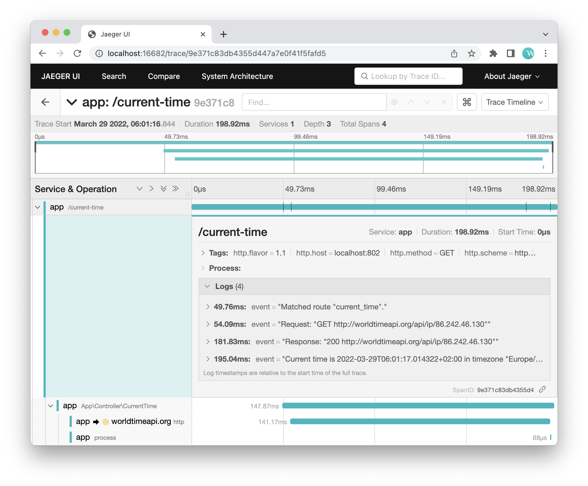

# Simple tracing example



```php
namespace App\Controller;

use Instrumentation\Tracing\Tracing;
use OpenTelemetry\API\Trace\SpanKind;
use OpenTelemetry\API\Trace\TracerInterface;
use OpenTelemetry\API\Trace\TracerProviderInterface;
use Symfony\Component\HttpFoundation\Request;
use Symfony\Component\HttpFoundation\Response;
use Symfony\Contracts\HttpClient\HttpClientInterface;

class CurrentTime
{
    public function __construct(
        private TracerProviderInterface $tracerProvider, 
        private HttpClientInterface $httpClient,
        private LoggerInterface $logger
    ) {
    }

    public function __invoke(Request $request): Response
    {
        $ip = $request->getClientIp();

        $span = $this->getTracer()->spanBuilder('http')
            ->setSpanKind(SpanKind::KIND_CLIENT)
            ->setAttribute('net.peer.name', 'worldtimeapi.org')
            ->startSpan();
        $info = $this->httpClient->request('GET', 'http://worldtimeapi.org/api/ip/' . $ip)->toArray();
        $span->end();

        $span = $this->getTracer()->spanBuilder('process')->startSpan();
        $result = sprintf('Current time is %s in timezone "%s".', $info['datetime'], $info['timezone']);
        $this->logger->info($result);
        $span->end();

        return new Response($result);
    }

    private function getTracer(): TracerInterface
    {
        return $this->tracerProvider->getTracer(Tracing::NAME);
    }
}
```
